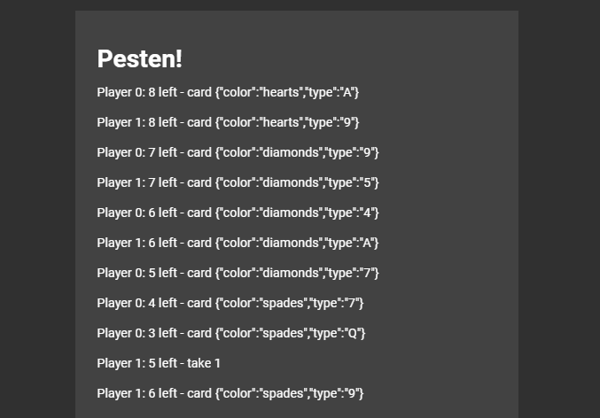

# vue-pesten

### Screenshot
Example part of program output:


**What this means:**
There are 2 AI players playing against each other. 
* Both players start with 8 cards, player 0 plays ace of hearts (color:'hearts',type:'A')
* Player 1 plays 9 of hearts

On the 7th line:

* Player 0 now has 5 cards left and plays the 7 of diamonds, this lets it go another turn
* Player 0 then plays another 7, allowing it another turn again. 
* Player 0 plays queen of spades
* Player 1 has no legal moves, so it takes one card from the deck
* The card player 1 took from the deck is a legal move, so it plays this card. 

This goes on until one player has no more cards.

This program can have AI play 100.000 full games out in 4.7 seconds 


## Todo
Add networking to play against other computers including AI bots
Add gui for playing game

## Project setup
```
npm install
```

### Compiles and hot-reloads for development
```
npm run serve
```

### Compiles and minifies for production
```
npm run build
```

### Lints and fixes files
```
npm run lint
```

### Customize configuration
See [Configuration Reference](https://cli.vuejs.org/config/).
